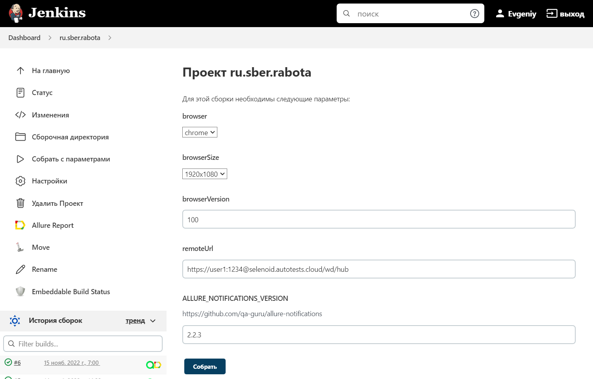
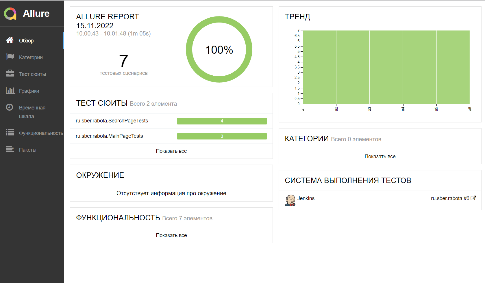
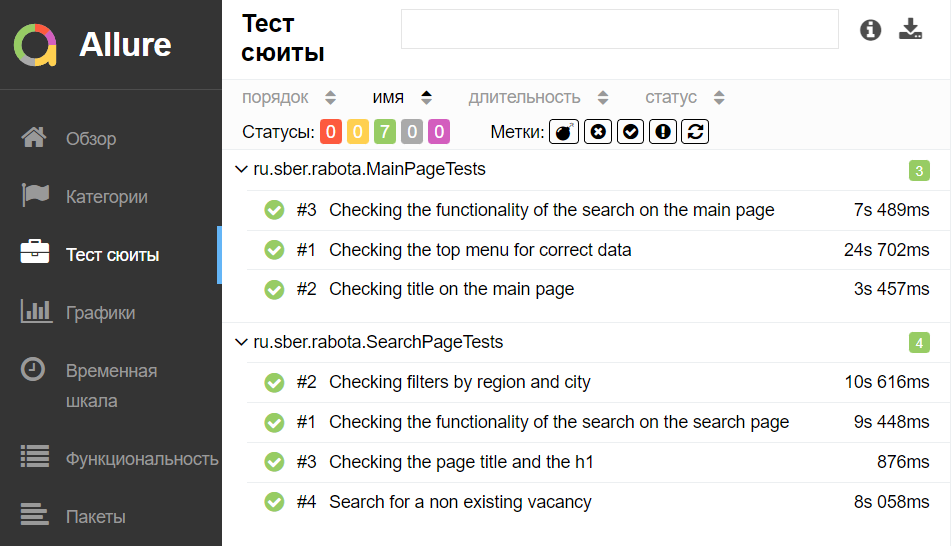
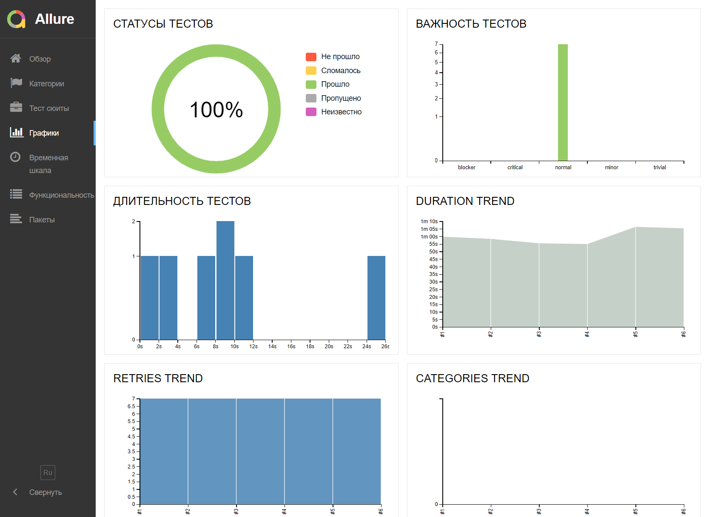
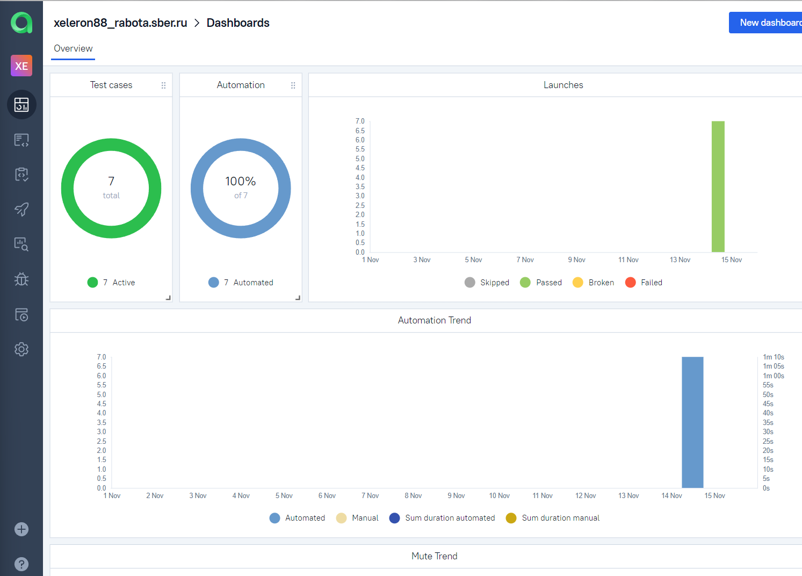
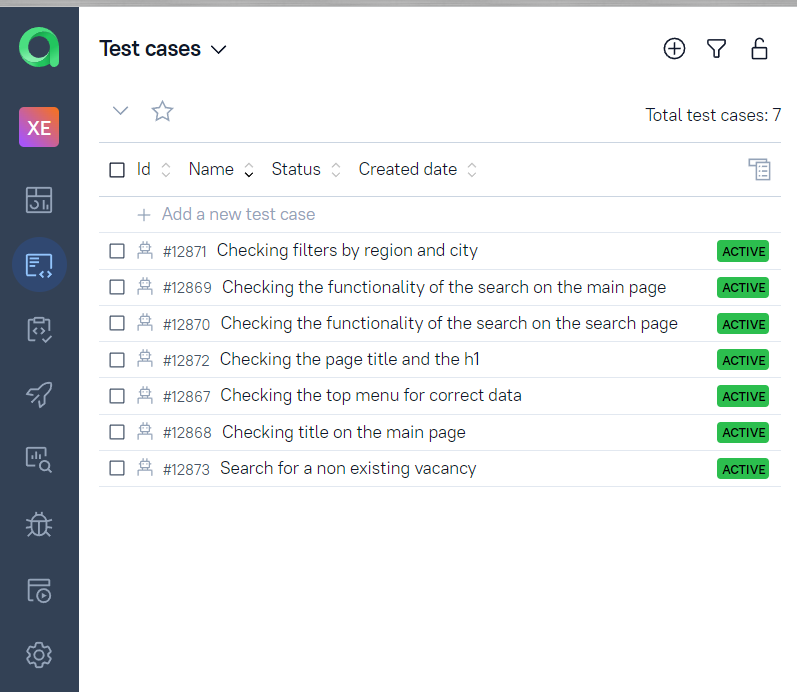
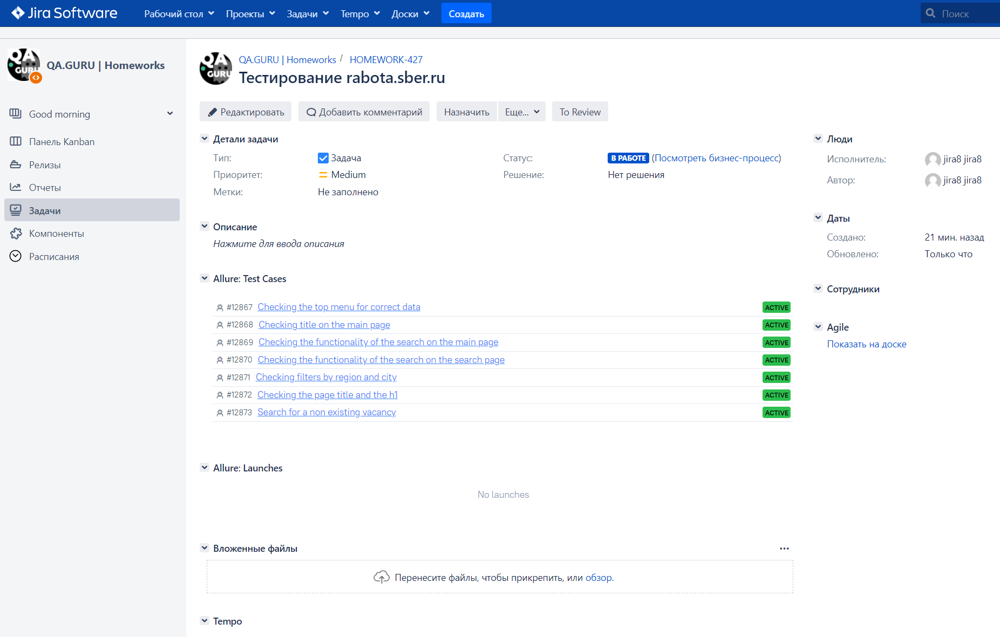
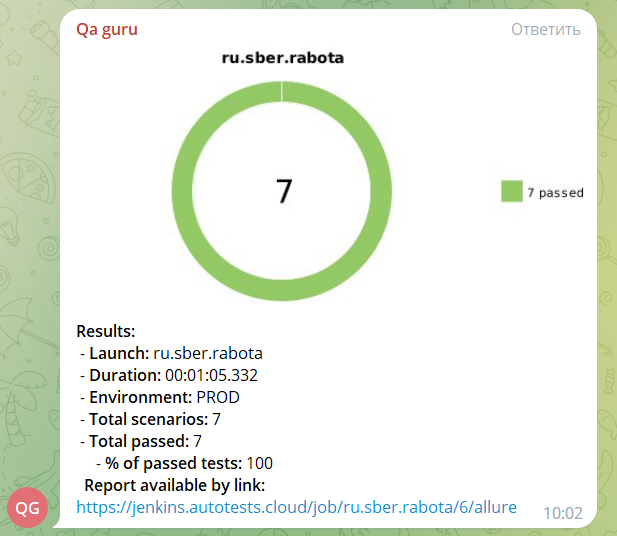
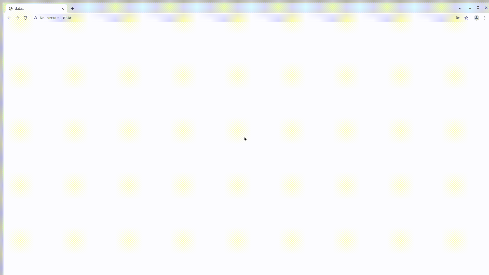

<h2 align="center"> Проект по автоматизации тестирования для компании Сбер </h2>
<a href="https://rabota.sber.ru"></a>

### :green_book: *Содержание*
- *Технологии и инструменты*
- *Примеры автоматизированных тест кейсов*
- *Сборка в Jenkins*
- *Команды для запуска из терминала*
- *Allure отчёт*
- *Интреграция с Allure TestOps*
- *Интеграция с Jira*
- *Уведомление в Telegram при помощи Alert bot*
- *Примеры видео выполнения тестов на Selenoid*

____
## :computer: *Технологии и инструменты*

<p align="center">  
<a href="https://www.jetbrains.com/idea/"></a>  
<a href="https://www.java.com/"></a>  
<a href="https://github.com/"></a>  
<a href="https://junit.org/junit5/"></a>  
<a href="https://gradle.org/"></a>  
<a href="https://selenide.org/"></a>  
<a href="https://aerokube.com/selenoid/"></a>  
<a href="https://github.com/allure-framework/allure2"></a> 
<a href="https://qameta.io/"></a>   
<a href="https://www.jenkins.io/"></a>  
<a href="https://www.atlassian.com/ru/software/jira/"></a>  
</p>

____
## *Примеры автоматизированных тест кейсов*
- :white_check_mark: Проверка title главной страницы
- :white_check_mark: Проверка наличия элементов в верхнем меню
- :white_check_mark: Проверка работоспособности поиска вакансий на главной странице
- 
- :white_check_mark: Проверка title и h1 на странице поиска
- :white_check_mark: Проверка работоспособности поиска вакансий на странице вакансий
- :white_check_mark: Проверка работы фильтров по региону и населённому пункту
- :white_check_mark: Проверка поиска несуществующих вакансий

____
## </a> Jenkins job
<a target="_blank" href="https://jenkins.autotests.cloud/job/ru.sber.rabota/">**Сборка в Jenkins**</a>
<p align="center">  
<a href="https://jenkins.autotests.cloud/job/ru.sber.rabota/"></a>  
</p>

### *Параметры сборки в Jenkins:*

- *BROWSER (браузер, по умолчанию chrome)*
- *BROWSER_VERSION (версия браузера, по умолчанию 100.0)*
- *BROWSER_SIZE (размер окна браузера, по умолчанию 1920x1080)*
- *REMOTE_DRIVER_URL (логин, пароль и адрес удаленного сервера Selenoid)*

____
## :keyboard: *Команды для запуска из терминала*

***Локальный запуск:***
```bash  
gradle clean test
```

***Удалённый запуск через Jenkins:***
```bash  
clean
test
-Dbrowser=${BROWSER}
-DbrowserSize=${BROWSER_SIZE}
-DbrowserVersion=${BROWSER_VERSION}
-DremoteUrl=${REMOTE_DRIVER_URL}
```

## </a> *Allure* <a target="_blank" href="https://jenkins.autotests.cloud/job/ru.sber.rabota/6/allure/">*отчёт*</a>
___

### *Основная страница отчёта*

<p align="center">  
  
</p>  

### *Тест кейсы*

<p align="center">  
  
</p>

### *Графики*

  <p align="center">  
  
</p>

___

## </a>*Интеграция с* <a target="_blank" href="https://allure.autotests.cloud/project/1668/dashboards">*Allure TestOps*</a>

## *Allure TestOps Dashboard*

<p align="center">  
  
</p>  

## *Тест кейсы*

<p align="center">  
  
</p>

___

## </a>*Интеграция с* <a target="_blank" href="https://jira.autotests.cloud/browse/HOMEWORK-427">Jira</a>

<p align="center">  
  
</p>

____
## </a> *Уведомление в Telegram при помощи Alert bot*

<p align="center">  
  
</p>


## </a> *Примеры видео выполнения тестов на Selenoid*



